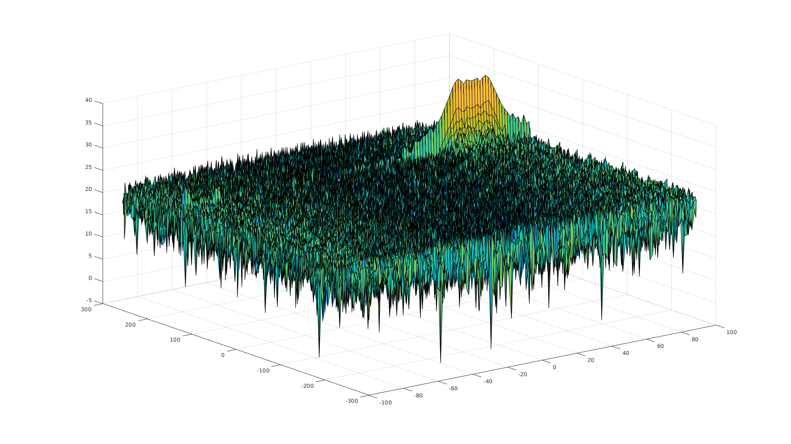
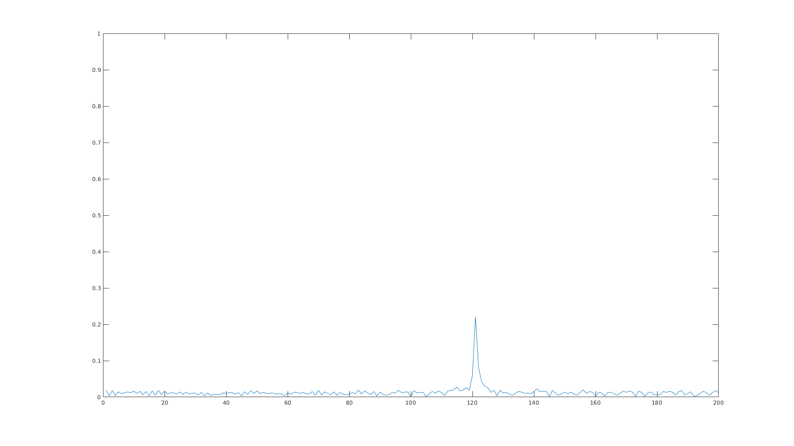
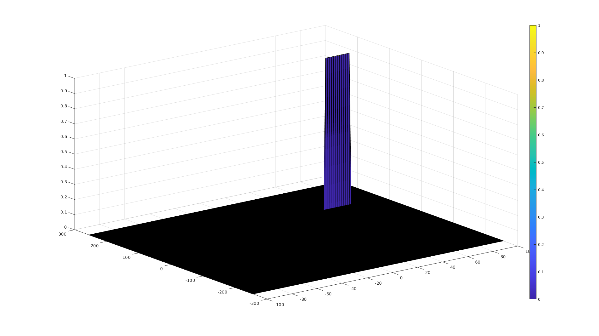

# Radar Target Generation and Detection

Implement 2D CFAR for final project for the Radar section of Udacity Sensor Fusion Nanodegree. This project uses Matlab to introduce frequency modulated continuous-wave (FMCW) radar and related post-processing techniques. The topics covered include:
- Fast Fourier transforms (FFT) and 2D FFT
- Clutter v. target discrimination
- Sizing chirp bandwith to meet system requirements for range resolution
- Phased array beam steering to determine angle of arrival (AoA)
- Constant false alarm rate (CFAR) noise suppression
- Signal-to-noise ratio (SNR) and dynamic thresholding

## Visualization of the results



## Installing Matlab
Instructions for installing the latest version of Matlab can be found at https://www.mathworks.com/

## Project description and write-up

### Implementation steps for the 2D CFAR process
_Lines 126-214 in script radar_target_generation_and_detection.m_

The 2D constant false alarm rate (CFAR), when applied to the results of the 2D FFT, uses a dynamic threshold set by the noise level in the vicinity of the cell under test (CUT). The key steps are as follows:
1. Determine the number of Training cells for each dimension Tr and Td. Similarly, pick the number of guard cells Gr and Gd.
2. Slide the Cell Under Test (CUT) across the complete cell matrix
3. Select the grid that includes the training, guard and test cells. Grid Size = (2Tr+2Gr+1)(2Td+2Gd+1).
4. The total number of cells in the guard region and cell under test. (2Gr+1)(2Gd+1).
5. This gives the Training Cells : (2Tr+2Gr+1)(2Td+2Gd+1) - (2Gr+1)(2Gd+1)
6. Measure and average the noise across all the training cells. This gives the threshold
7. Add the offset (if in signal strength in dB) to the threshold to keep the false alarm to the minimum.
8. Determine the signal level at the Cell Under Test.
9. If the CUT signal level is greater than the Threshold, assign a value of 1, else equate it to zero.
10. Since the cell under test are not located at the edges, due to the training cells occupying the edges, we suppress the edges to zero. Any cell value that is neither 1 nor a 0, assign it a zero.

### Selection of training cells, guard cells, and offset
_Lines 148-161 in script radar_target_generation_and_detection.m_

The values below were hand selected. Please note that the provided Range-Doppler Map has a higher noise variance in the doppler axis than the range axis. This means we could use only a larger amount of training and guard cells in the doppler dimension. The offset value (in dB) based on the desired thresholded response was the only one chosen. The final values are:

```
Tr = 12;
Td = 28;
Gr = 4;
Gd = 8;
offset = 15.5;
```

### Steps taken to suppress the non-thresholded cells at the edges
_Line 182 in script radar_target_generation_and_detection.m_

```
rdmThresholded = zeros(size(RDM));
```
The thresholded response was initialized to zeros and the indexing was chosen such that the edges were never updated. Thus, the edges that cannot evaluate the CUT are all set to 0.

### FMCW Waveform Design
Using system requirements, the Bandwidth `B`, time chirp as `Tchirp`, the slope of the chirp was found to be `2.0455e+13`.

### Simulation Loop
The signal beat was implemented inside the script, the next section verifies that the 1D FFT result is within the error margin of +/- 10 meters.

### Range FFT (1st FFT)
The range FFT was implemented inside the script file on the beat or mixed signal. For the initial range of 120 meters, the result of the 1D range FFT is plotted on the following image:



### 2D CFAR
2D CFAR is implemented on the output of the 2D FFT (Range-Doppler map). Notice that the noise is supressed and target signal remains:

